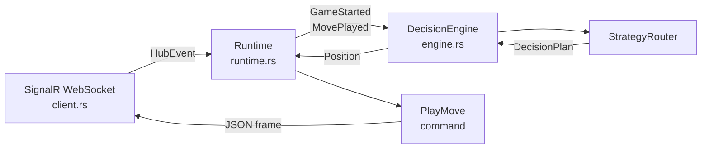
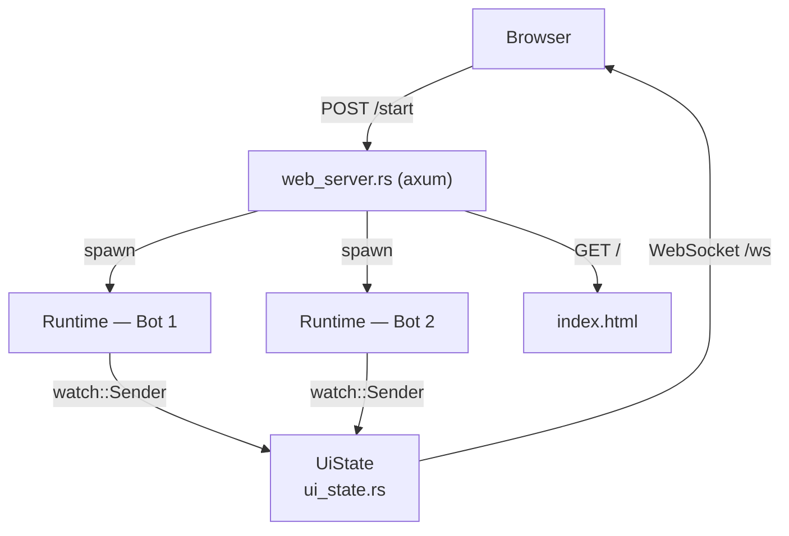
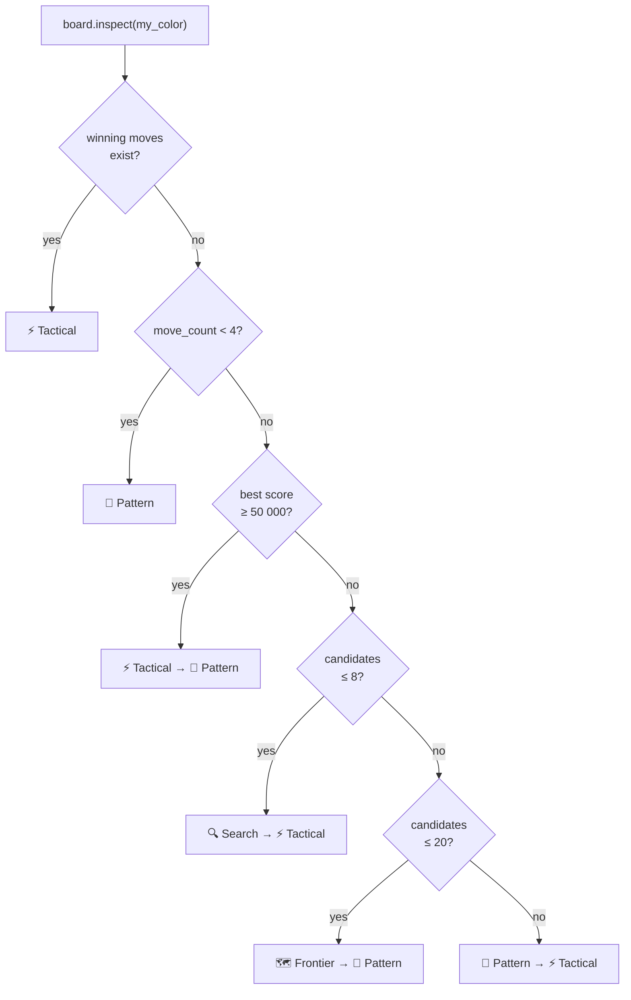
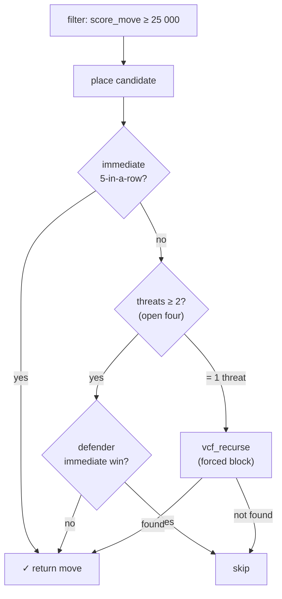
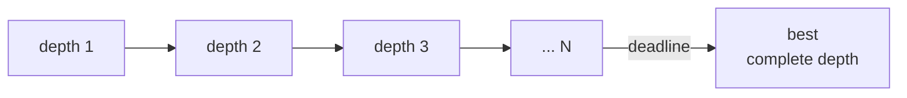
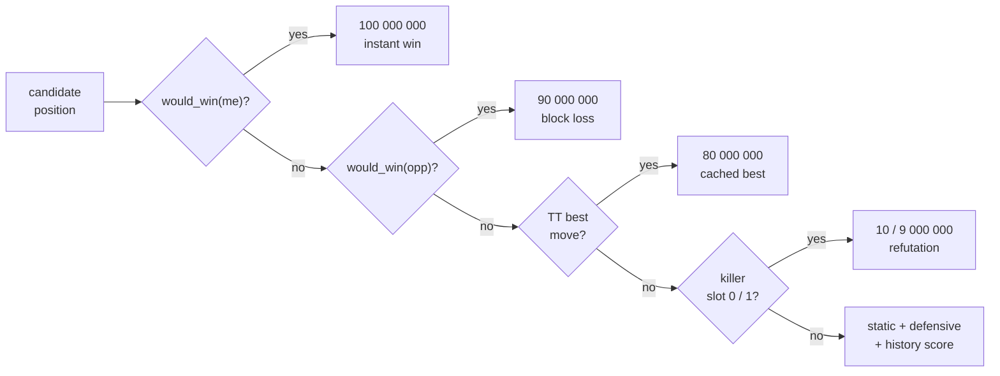
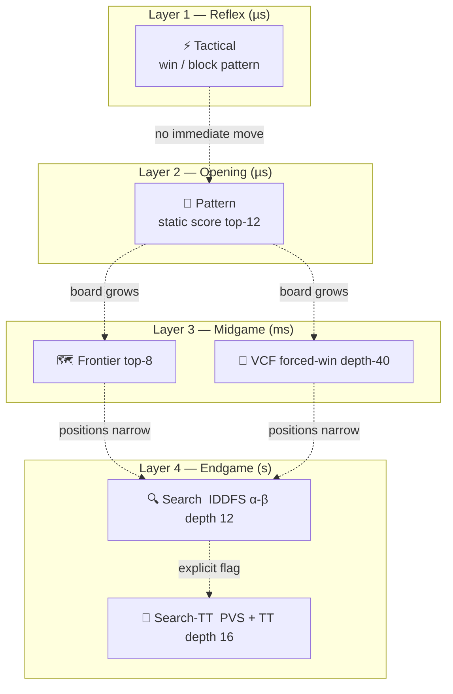

# Gomoku Bot
## A Rust strategy engine for Connect-5

<div class="pt-12 text-gray-400">Press Space to advance</div>

---
layout: two-cols
---

# Project Structure

**Cargo workspace** — `rust-gomoku-bot/`

```
crates/
├── gomoku-core/        # Pure library (no I/O)
│   ├── board.rs        18×18 grid + scoring
│   ├── engine.rs       DecisionEngine
│   ├── strategy/
│   │   ├── router.rs   Dispatch logic
│   │   ├── tactical.rs Immediate win/block
│   │   ├── pattern.rs  Score-based pick
│   │   ├── frontier.rs Pruned candidate set
│   │   ├── vcf.rs      Forced-win search
│   │   ├── search.rs   Alpha-beta IDDFS
│   │   └── search_tt.rs PVS + TT
│   ├── transposition_table.rs
│   └── zobrist.rs
└── gomoku-cli/         # Binary + I/O
    ├── client.rs       SignalR WebSocket
    ├── runtime.rs      Event-driven loop
    ├── local_server.rs Offline server
    └── web_server.rs   Browser UI
```

::right::

# Run Modes

| Mode | Flag |
|---|---|
| Online (guest) | `--mode guest` |
| Online (registered) | `--mode registered` |
| Browser UI | `--ui` |
| Offline server | `--local-server` |
| Smoke test | `--demo` |

<br/>

**Strategy override:**

```bash
--strategy tactical|pattern|search|adaptive
```

`adaptive` = use the router (default)

---

# Data Flow — Bot Mode



---

# Data Flow — UI Mode



---
layout: center
---

# Board & Scoring

18 × 18 grid — Black plays first

### Static pattern values (`score_move`)

| Pattern | Score |
|---|---|
| Five in a row | **1 000 000** |
| Open four (≥ 2 threats) | **100 000** |
| Closed four | **25 000** |
| Strong three | **8 000** |
| Solid extension | **2 000** |

`candidate_positions()` — empty cells within **2 steps** of any stone (center on empty board)

`position_score(pos) = score_move(me, pos) + score_move(opp, pos) + center_bonus`

---
layout: center
---

# Strategy Overview

| Strategy | Router trigger | Mechanism |
|---|---|---|
| **Tactical** | win / blocking move exists | Immediate pattern → respond |
| **Pattern** | opening (< 4 moves) or default | Top-12 candidates by static score |
| **Frontier** | medium board (≤ 20 candidates) | Top-8 candidates by static score |
| **VCF** | forced-win lookup | Depth-first consecutive-fours search |
| **Search** | tight board (≤ 8 candidates) | IDDFS alpha-beta, depth ≤ 12 |
| **Search-TT** | explicit `--strategy` flag | PVS + transposition table, depth ≤ 16 |

---

# Strategy Router



---
layout: two-cols
---

# Tactical Strategy

**Reflex layer — microsecond cost**

```
1. winning_moves(me)  → play it  ✓ (score: INT_MAX/4)
2. winning_moves(opp) → block it ✗ (score: INT_MAX/5)
3. for each candidate:
     score = mine×2 - theirs
   → return best
```

**Score labels:**
- `≥ 100 000` → "open four pressure"
- `≥ 8 000` → "threat building"
- else → "local tactical pressure"

::right::

# Pattern Strategy

**Opening phase & default fallback**

```
candidates = candidate_positions()
sort by position_score DESC
take top 12
→ return highest scoring
```

**Score labels:**
- `≥ 8 000` → "strong pattern"
- `≥ 2 000` → "solid extension"
- else → "positional improvement"

**Frontier** is Pattern with top-8 only — used when the board has ≤ 20 candidates (midgame focus).

---

# VCF — Victory by Consecutive Fours

> Only plays moves with score **≥ 25 000** (a four or better). Defender has exactly **one forced reply** → near-linear tree → depth 40 in milliseconds.



Also inverts attacker/defender to **block opponent's VCF win**.

---
layout: two-cols
---

# Search — IDDFS Alpha-Beta

**Tight endgame (≤ 8 candidates)**

```
root candidates : top 15 by static score
inner candidates: top  8 per node
depths          : 1 → 12
deadline        : 4.5 s
poll deadline   : every 512 nodes
```

Only fully-searched depths are committed — a depth interrupted by the deadline is discarded.

A greedy depth-0 seed ensures a move is always returned.



::right::

# Search-TT — PVS + Transposition Table

**Explicit flag only — strongest engine**

Extra layers on top of Search:
- Depths up to **16**, inner limit **12**
- **TT probe**: skip re-search if depth-sufficient entry found
- **TT best move**: tried first before all other ordering
- **Killer heuristic**: 2 slots per ply → `store_killer` on β-cutoff
- **History heuristic**: `depth²` bonus on β-cutoff

**2-tier TT (32 MB, 1M slots):**

| Tier | Replacement policy |
|---|---|
| 0 — always-replace | freshest data, fast lookup |
| 1 — depth-preferred | keeps deep results longer |

---

# Move Ordering in Search-TT



---
layout: center
---

# Layered Strategy Architecture



> The router picks **the cheapest strategy that produces a good move** — tactical reflexes cost microseconds, deep search is reserved for tight positions where it matters most.
